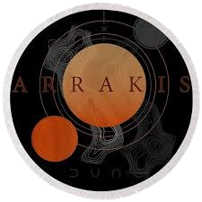
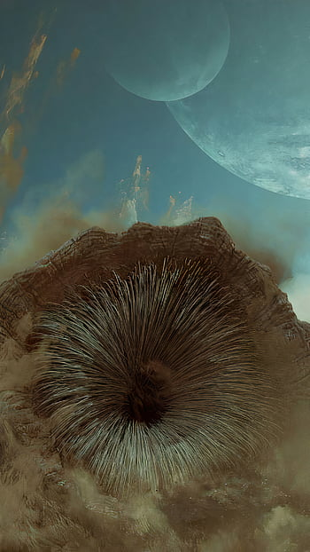
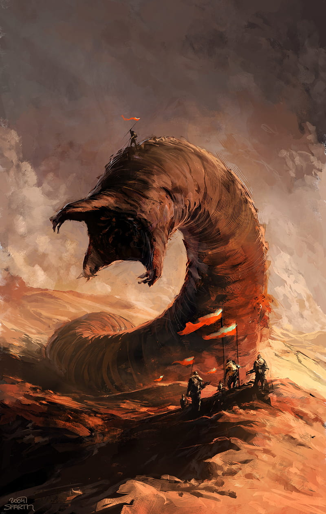
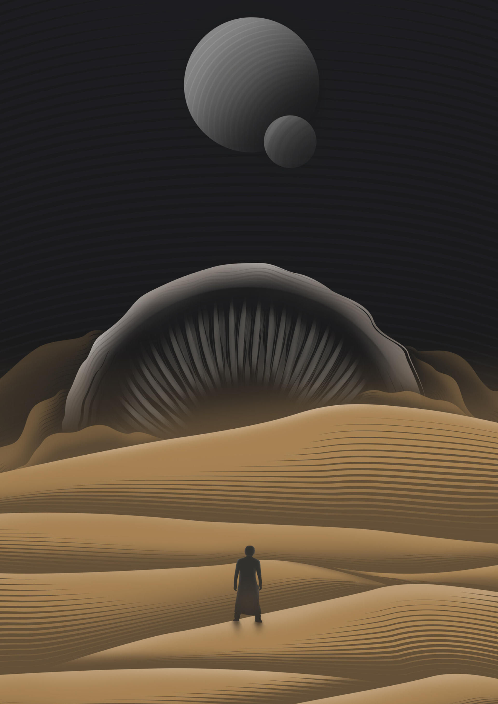

<div align="center">
  
  
  # 🏜️ ARRAKIS ARCHIVE 🏜️
  
  
  
  *"The beginning is a very delicate time..."*
  
  **A Flutter-powered digital sanctuary for the chronicles of the desert planet**
  
  [](https://flutter.dev)
  [](https://dart.dev)
  [](https://flutter.dev)
</div>

---

## 🌌 About the Archive

> _"Dreams make good stories, but everything important happens when we're awake."_  
> — Frank Herbert

**Arrakis Archive** is more than just a mobile application—it's a digital testament to the power of knowledge preservation in the vast desert of information. Built with the precision of a Fremen's stillsuit and the elegance of a Guild Navigator's prescience, this Flutter application serves as your personal chronicle keeper.

<div align="center">
  
  
  
</div>

---

## ⚡ Features of the Spice

> _"The spice must flow."_

-   📜 **Post Archives**: Chronicle your thoughts like a Mentat's perfect memory
-   💬 **Comment Threads**: Engage in discourse worthy of the Landsraad
-   🎨 **Dune-Inspired UI**: Golden sands and desert winds guide the interface
-   🌐 **Cross-Platform**: Works across all devices like the reach of the Spacing Guild
-   🔄 **Real-time Updates**: Information flows as constantly as spice through the universe

---

## 🛠️ Technology Stack

> _"Without change, something sleeps inside us, and seldom awakens."_

-   **Framework**: Flutter (The chosen technology of the future)
-   **Language**: Dart (As precise as Fremen blade work)
-   **Fonts**:
    -   🏺 **Dune Rise** - For headers that command like Muad'Dib
    -   📚 **DidotLT** - For content as refined as Caladan's culture
    -   🔤 **Futura** - For the future of Arrakis
-   **Architecture**: Clean, modular design principles inspired by Holtzman efficiency

---

## 🚀 Getting Started

> _"He who controls the spice controls the universe."_

### Prerequisites

Ensure your development environment has the sacred tools:

```bash
Flutter SDK >= 3.0.0
Dart SDK >= 3.0.0
```

### Installation

1. **Clone the sacred repository:**

    ```bash
    git clone https://github.com/Pfftz/arrakis-archive.git
    cd arrakis-archive
    ```

2. **Retrieve the dependencies:**

    ```bash
    flutter pub get
    ```

3. **Run the application:**
    ```bash
    flutter run
    ```

### Available Platforms

-   📱 **Android** - For the common folk of the Imperium
-   🍎 **iOS** - For the refined tastes of noble houses
-   💻 **Web** - Accessible across the known universe
-   🖥️ **Desktop** - For the command centers of great houses

---

## 📁 Project Structure

> _"The mystery of life isn't a problem to solve, but a reality to experience."_

```
arrakis-archive/
├── 🎨 assets/
│   ├── fonts/           # Sacred typography of the desert
│   └── images/          # Visual chronicles of Arrakis
├── 📚 lib/
│   ├── controllers/     # The navigators of data flow
│   ├── models/         # Blueprints of digital spice
│   ├── pages/          # The interfaces users traverse
│   └── main.dart       # The genesis file
└── 🧪 test/            # Trials to ensure perfection
```

---

## 🎨 Visual Identity

> _"The beginning is a very delicate time. Know then that this is the year 10191..."_

Our design philosophy draws inspiration from the infinite beauty of Arrakis:

-   **Color Palette**: Golden sands (#e79b07), Rich earth (#b29254), Deep desert (#3d2d1c)
-   **Typography**: Carefully chosen fonts that evoke the grandeur of the Dune universe
-   **Imagery**: Desert landscapes that transport users to the spice planet

---

## 🤝 Contributing

> _"A beginning is the time for taking the most delicate care that the balances are correct."_

We welcome contributors like the Fremen welcome water. To join our cause:

1. Fork the repository
2. Create your feature branch (`git checkout -b feature/amazing-feature`)
3. Commit your changes (`git commit -m 'Add some amazing feature'`)
4. Push to the branch (`git push origin feature/amazing-feature`)
5. Open a Pull Request

---

## 📜 License

> _"The concept of progress acts as a protective mechanism to shield us from the terrors of the future."_

This project is open source and available under the [MIT License](LICENSE).

---

## 🌟 Acknowledgments

> _"Fear is the mind-killer. Fear is the little-death that brings total obliteration."_

-   Frank Herbert for creating the magnificent universe of Dune
-   The Flutter team for providing the tools to build across all platforms
-   The open source community for their endless wisdom

---

<div align="center">
  
  **"The sleeper must awaken."**
  
  *May your code be bug-free and your apps reach across the stars.*
  
  ---
  
  Made with ❤️ and ☕ on the desert planet of Arrakis
  
</div>
